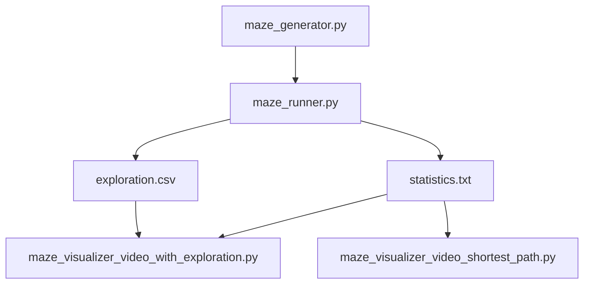

# Maze Runner

A compact maze generation, solving, and visualisation project built in Python.

This repo takes a maze from raw text, solves it with breadth-first search, logs the exploration, and turns the result into a polished video animation. The whole pipeline is designed to feel like a complete system rather than a collection of scripts.

## What Makes It Interesting

- Generates mazes of different sizes, from tiny practice layouts to very large grids.
- Solves each maze with BFS, so the shortest path is guaranteed for the maze representation used here.
- Logs exploration order and path statistics for analysis.
- Produces two kinds of visual output:
  - exploration + shortest path
  - shortest path only
- Uses a simple ASCII maze format, which makes the project easy to inspect, edit, and extend.

## Project Workflow

1. `maze_generator.py` creates a new maze file, if needed.
2. `maze_runner.py` loads the maze, solves it with BFS, and writes the logs.
3. `exploration.csv` stores the BFS visit order.
4. `statistics.txt` stores the shortest path and summary statistics.
5. `maze_visualizer_video_with_exploration.py` uses both log files to build the full animation.
6. `maze_visualizer_video_shortest_path.py` uses `statistics.txt` to build the shortest-path-only animation.



## Requirements

- Python 3.10 or newer
- `numpy`
- `Pillow`
- `tqdm`
- `ffmpeg` available on your PATH

Install dependencies with:

```bash
pip3 install numpy pillow tqdm
```

## How To Run The Project

The recommended order is:

1. Generate a maze, or choose one from `mazes/`.
2. Solve the maze with `maze_runner.py`.
3. Create a video with one of the visualiser scripts.

### 1. Generate a maze

Run:

```bash
python3 maze_generator.py
```

The script will ask for width and height, then save a maze file such as:

```text
small_10x10.mz
medium_100x100.mz
huge_500x500.mz
```

### 2. Solve a maze

Run:

```bash
python3 maze_runner.py mazes/small_maze1.mz
```

Optional start and goal positions:

```bash
python3 maze_runner.py mazes/small_maze1.mz --starting 0,0 --goal 4,4
```

This produces:

- `exploration.csv`
- `statistics.txt`

### 3. Create a video

Exploration plus shortest path:

```bash
python3 maze_visualizer_video_with_exploration.py
```

Shortest path only:

```bash
python3 maze_visualizer_video_shortest_path.py
```

Outputs:

- `maze_exploration_and_shortest_1080p.mp4`
- `shortest_path_1080p.mp4`

## File Guide

### `maze_generator.py`
Interactive maze creator.

This script:

- asks for maze dimensions
- generates a random maze
- writes the maze to a `.mz` file

Use this when you want a brand-new maze instead of one from the `mazes/` folder.

### `maze_runner.py`
Main solver and logger.

This is the heart of the project. It:

- reads a maze file
- validates the ASCII layout
- runs BFS from the start cell to the goal cell
- prints the shortest path
- writes the exploration log and statistics file used by the visualisers

### `maze.py`
Maze data structure and BFS logic.

It stores walls, calculates legal moves, performs exploration, and reconstructs the shortest path.

### `runner.py`
Small helper module for runner state and movement.

This file supports the maze model by handling orientation and movement primitives.

### `maze_visualizer_video_with_exploration.py`
Video exporter for the full run.

It paints:

- explored cells in red
- the shortest path in green

### `maze_visualizer_video_shortest_path.py`
Video exporter for the final path only.

It focuses on the solution route and shows the current position as the path is traced.

### `mazes/`
Example maze library.

You can run the solver immediately on these files without generating anything first. Examples include:

- `mazes/small_maze1.mz`
- `mazes/medium_maze1.mz`
- `mazes/large_maze1.mz`
- `mazes/huge_maze1.mz`
- `mazes/massive.mz`
- `mazes/doom_maze.mz`

There is also `mazes/tiny_maze1`, which is a plain ASCII maze file without the `.mz` extension.

## Example Commands

Use a bundled maze:

```bash
python3 maze_runner.py mazes/small_maze1.mz
python3 maze_visualizer_video_with_exploration.py
```

Generate your own maze and visualise the solution:

```bash
python3 maze_generator.py
python3 maze_runner.py small_20x20.mz
python3 maze_visualizer_video_shortest_path.py
```

## Maze File Format

Maze files are plain text grids made from:

- `#` for walls
- `.` for open space

The solver expects:

- a fully enclosed outer border
- odd dimensions in the ASCII file
- coordinates given in zero-based `x,y` form

## Output Files

After solving a maze, the repo root will contain:

- `exploration.csv` for BFS visit order
- `statistics.txt` for score, path length, and path data
- one or both MP4 files from the visualisers

## Why This Project Stands Out

The project is not just solving mazes. It is turning the solution process into a complete pipeline:

- generation
- validation
- search
- logging
- visualisation

That makes it a strong base for experimenting with algorithms, performance, or even richer animation styles later on.

## Notes

- BFS guarantees the shortest path for the graph structure used here.
- Start and goal positions default to `(0, 0)` and the top-right cell if not provided.
- The visualisers depend on `exploration.csv`, `statistics.txt`, and the original maze file generated by the solver.
